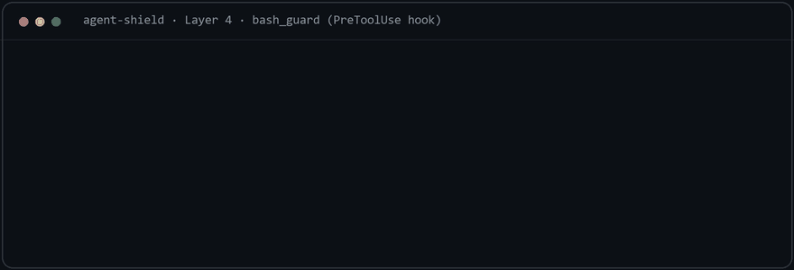

# agent-shield

> **Defensive overlay for AI agents.** An 8-layer security stack that sits between your agent and the outside world — inspecting, sanitizing, auditing, and blocking risky actions before they reach the host.
>
> *A **PDuk Brainworks** project. Sibling to the [Ultimate Memory Stack](https://github.com/esoteric1entity/ultimate-memory-stack). Apache-2.0.*

[](LICENSE)
[](#project-status)
[](pyproject.toml)
[](https://github.com/esoteric1entity/agent-shield/actions/workflows/test.yml)

---

## What it does

`agent-shield` is a layered defensive overlay for AI agents. It intercepts what your agent is about to do — run a command or write a file — and applies a tiered RED / YELLOW / GREEN decision policy before letting it through. (Network egress — fetching a URL — is the roadmap Layer 5, not yet shipped.)

v0.1.0 ships **six of the eight layers** — Layers 1, 2, 3, 4, 6, and 7 (see [The 8 layers](#the-8-layers) and [Project status](#project-status)):

- **Layer 4 — Runtime Hooks** is the headline runtime surface. It runs on a **harness-agnostic architecture** (one neutral decision core, per-harness adapters) with two functional adapters shipping today: **Claude Code** (via PreToolUse hook; CI-verified) and **OpenClaw** (via `before_tool_call`; live but enforcement requires a recent gateway — see [`docs/adapter_status.md`](docs/adapter_status.md)). Additional harnesses (Codex, Gemini, Copilot, etc.) are roadmap.
  - **`bash_guard`** — inspects bash commands before execution
  - **`write_guard`** — inspects write / edit targets before they touch disk
- **Layers 1, 2, 3, 6, 7** — `skill_vetting`, `sanitize`, `structured_output`, `audit`, and `config` — ship as importable library modules.

Layers 0 (operational/automation) and 5 (network egress) are in development.

---

## See it in action



*The Layer 4 hook's actual decisions and reason strings, rendered for readability — the live hook emits them as JSON. A safe command prints nothing and exits 0; only `ask` and `deny` emit output. Run the three checks yourself: [`demo/demo.sh`](demo/demo.sh).*

---

## Quick start

**Prerequisites:** Python 3.11+ (standard library only — zero runtime dependencies). On Windows, run the shell commands in Git Bash, WSL, or PowerShell (adapt as needed); the guards themselves are pure Python.

Install (pick your door):

```bash
# From the repo (the install path today)
pip install git+https://github.com/esoteric1entity/agent-shield.git

# From PyPI — not yet published; coming with the public release:
#   pip install agent-shield
```

Or **tell your agent**: clone the repo and say *"install this — read `INSTALL_AGENT.md` and follow it."* The agent walks a documented, consent-gated flow (it never touches your settings without showing you the diff).

Use as a library:

```python
from agent_shield import bash_guard, write_guard

result = bash_guard.check_command("rm -rf /")
print(result.decision)  # "deny"
print(result.reason)    # "Destructive rm -rf targeting root directory"

result = write_guard.check_path("/foo/.claude/settings.json")
print(result.decision)  # "deny"
```

Use as a Claude Code PreToolUse hook:

```bash
echo '{"tool_input":{"command":"rm -rf /"}}' | python -m agent_shield.bash_guard
# {"hookSpecificOutput": {"hookEventName": "PreToolUse",
#                          "permissionDecision": "deny",
#                          "permissionDecisionReason": "..."}}
```

> **Reading the output:** a safe command prints **nothing** and exits 0 — empty stdout means *allow*. Only `ask` and `deny` emit JSON.

Wire it into `~/.claude/settings.json` (the **module form** below — `python -m agent_shield.bash_guard` — is the most portable; the `agent-shield-bash-guard` / `agent-shield-write-guard` console scripts installed with the package also work when the package's scripts directory is on `PATH`):

```json
{
  "hooks": {
    "PreToolUse": [
      {
        "matcher": "Bash",
        "hooks": [{"type": "command", "command": "python -m agent_shield.bash_guard"}]
      },
      {
        "matcher": "Write|Edit|MultiEdit",
        "hooks": [{"type": "command", "command": "python -m agent_shield.write_guard"}]
      }
    ]
  }
}
```

---

## The 8 layers

| # | Layer | What it does | Status |
|---|---|---|---|
| 0 | Operational + Automation | Cron schedule for hygiene tasks (audit / key / log rotation) | 🟡 pre-release |
| 1 | **Skill / Tool Vetting** | **`skill_vetting`** — static read-only scan → 3-tier verdict (approved/review/rejected); 5-layer manual escalation for the review tier | ✅ **v0.1.0** |
| 2 | **Input Sanitization** | **`sanitize`** — 4-layer (structural strip · content flag · encoding detect · nonce-delimited context wrap) for untrusted incoming content | ✅ **v0.1.0** |
| 3 | **Structured Output** | **`structured_output`** — enforce a declared schema (shape, not content/intent) + reject prose-wrapped JSON | ✅ **v0.1.0** |
| 4 | **Runtime Hooks** | **`bash_guard` + `write_guard`** | ✅ **v0.1.0** |
| 5 | Network Egress | URL allowlist + Ollama proxy + rate limiting | 🟡 pre-release |
| 6 | **Structured Audit** | **`audit`** — append-only JSONL + SHA-256 hash-chain (tamper-evident), `verify()` + `--verify` CLI, optional external anchor (local-path / bring-your-own-shipper — **never phones home**) | ✅ **v0.1.0** |
| 7 | **Configuration** | **`config`** — TOML loader + compliance presets + the shared cross-layer contract; never-crash, opt-in wiring | ✅ **v0.1.0** |

---

## Layer 4 — Runtime Hooks (shipping)

### Tier model

Every check returns a `GuardResult` with one of three decisions:

| Tier | Decision | Behavior |
|---|---|---|
| 🔴 **RED** | `deny` | Block outright — the operation is dangerous (`rm -rf /`, credential exfiltration, disk format, etc.) |
| 🟡 **YELLOW** | `ask` | Prompt the user — the operation is risky but has legitimate uses (`git push --force`, `chmod 777`, package install) |
| 🟢 **GREEN** | `allow` | Pass through — operation is safe (read-only ops, version-control queries, etc.) |

### `bash_guard.check_command(cmd)` — patterns

- **24 RED patterns**: destructive filesystem ops — `rm -rf` against root / home / cwd targets, including quoted (`rm -rf "/"`), split-flag (`rm -r -f /`), and bundled / reordered / intervening-flag (`rm -rfv /`, `rm -fvr /`, `rm -rf -- /`) forms, `--no-preserve-root`, `mkfs.*`, `format X:` / `wipefs`, `dd` onto block devices, fork bombs; remote-code execution — pipe-to-shell (`curl … | bash`), pipe-to-source, decode-and-execute (`base64 -d | sh`), process substitution (`bash <(curl …)`), encoded PowerShell; credential exfiltration — `$VAR` / `${VAR}` secrets in network commands, uploading secret files (`curl -d @id_rsa`), piping secret files to network tools.
- **11 YELLOW patterns**: recursive force-deletes off-root (`rm -rf`, split-flag form, Windows `del /s`, `Remove-Item -Recurse -Force`, `shred`); network uploads; destructive git operations; package installs; `chmod 777`; Windows registry edits; service/process control.
- **GREEN is not a pattern list** — it is the default: anything not matched by a RED or YELLOW pattern passes silently. There is no allowlist.

### `write_guard.check_path(file_path)` — patterns

- **6 RED patterns**: `.claude/settings.json` + `settings.local.json` (hook/permission configs); `agent_shield/*` guard modules + legacy `hooks/scripts/*-guard.sh` (self-protect); SSH private keys (`~/.ssh/id_*` — unambiguously secret); `.openclaw/.env` (agent API credentials).
- **12 YELLOW patterns**: agent-shield policy config (`agent-shield.toml`, `~/.agent-shield/config.toml` — Layer 7; editing changes the agent's own security policy, but the file is user-edited so ask, not deny); agent templates; orchestration rules; other hook scripts; memory files; `.env*` files; shell startup files (`.bashrc`, `.zshrc`, profiles — persistence vector); credential-named files (`secrets.json`, `tokens.yaml`, …); `*.pem` / `*.key` (ask, not deny — content-blind: a `.pem` may be a public cert and `.key` is also Apple Keynote's document type, so confirm rather than hard-block); `CLAUDE.md`; sync protocol files.
- **GREEN is the default** — everything else passes silently.

Path matching is normalization-hardened: backslashes, case, NTFS alternate-data-stream suffixes (`file.py::$DATA`), and trailing spaces/dots are normalized away before patterns run, so Windows path-disguise tricks can't slip past the `$`-anchored rules.

Full pattern lists live in `agent_shield/bash_guard.py` and `agent_shield/write_guard.py`. Each pattern carries an inline comment explaining the threat model it addresses. **The counts above are verified by automated tests** — if code and README drift, the release is blocked.

---

## Layer 1 — Skill / Tool Vetting (shipping)

Vet a skill / MCP server / hook / package **before** you install it. `skill_vetting` does a **static, read-only** scan (it never executes, imports, writes, or network-fetches the target), scores it 0–10, and returns a 3-tier verdict:

| Verdict | Score | Meaning |
|---|---|---|
| 🟢 **approved** | 0–2 | No high/critical signals — safe to install |
| 🟡 **review** | 3–7 | Real signals — a human should look (see the 5-layer escalation rubric in `docs/VETTING_ESCALATION.md`) |
| 🔴 **rejected** | 8–10 | Critical signal(s) — do not install |

```python
from agent_shield import skill_vetting
r = skill_vetting.vet_path("/path/to/some-skill")
r.tier      # "approved" | "review" | "rejected"
r.findings  # list of Finding(category, severity, file, line, snippet, why)
```

```bash
python -m agent_shield.skill_vetting /path/to/some-skill            # exit 0/1/2 = approved/review/rejected
python -m agent_shield.skill_vetting /path/to/some-skill --format json
```

**Threat categories** (code files scanned line-by-line; instruction files scanned for injection; dependency manifests checked for typosquats): `ENV_BULK`, `ENV_SCRAPE`, `CRED_PATH`, `FS_DANGER`, `PIPE_TO_SHELL`, `PERSIST`, `NET_EXFIL`, `CRYPTO_MINE`, `PROMPT_INJECTION`, `TYPOSQUAT`. The category list is verified by automated tests — drift between code and docs is detected at release time. This is a static heuristic gate, not a sandbox — see [Bypasses and limitations](#bypasses-and-limitations).

---

## Layer 2 — Input Sanitization (shipping)

`agent_shield.sanitize` sanitizes **untrusted incoming content** — web fetches, tool/MCP output, user input, agent-to-agent handoffs — before it reaches the model. It **strips** invisible/control characters (destructive, safe) and **detects and flags** injection markers and suspicious encodings (non-destructive by default).

Layer 2 (sanitize) **detects and flags** injection markers and encodings — including
forged harness framing tags (`<system-reminder>`, `<system>`, `<assistant>`, `<user>`,
`<instructions>`) as of this release. It **detects and flags** these — it does **not**
block or intercept them at the model layer: novel phrasings and creative encodings are
unbounded, and semantic injection at the model layer is outside what a guard can stop.
agent-shield's defense is **detection**, **action-boundary prevention** (Layer 4 blocks
dangerous outcomes), **cost-raising** (nonce wrappers), and **evidence** (Layer 6
tamper-evident audit). It does not prevent determined semantic injection. For untrusted
fetched content, see `examples/fetch-wrap.example.py`.

> **Harness-tag spoofing class (F-001, detected as of this release):** On 2026-05-12 a
> class of injection was observed where attacker-controlled content attempted to
> harness spoof by forging structural framing tags to impersonate harness-level
> context boundaries. Layer 2 now detects and flags this class. No working payload is
> published here — see [`SECURITY.md`](SECURITY.md) for the disclosure posture.

```python
from agent_shield import sanitize

rep = sanitize.sanitize(untrusted, source="web")
rep.text            # cleaned text (invisible/zero-width, BIDI + directional marks, tag/control chars stripped; NFKC-normalized)
rep.findings        # SanitizeFinding(sublayer, kind, span, snippet, why) — markers/encodings flagged
rep.stripped_count

clean = sanitize.clean(untrusted)           # just the cleaned string

# nonce-delimited typed wrappers (each cleans first, then wraps):
sanitize.wrap_web(content, url="https://example.com/page")
sanitize.wrap_user_input(content)
sanitize.wrap_agent_output(content, agent="planner")
sanitize.wrap_tool_output(content, tool="grep")
```

- **Four sub-layers:** **structural** (strip zero-width invisibles incl. WORD JOINER / invisible-math / interlinear anchors, BIDI overrides/isolates **and directional marks** (LRM/RLM/ALM), tag / control chars + lone surrogates; ZWJ/ZWNJ preserved), **content** (flag instruction-injection & jailbreak markers; opt-in `strict=True` neutralizes them), **encoding** (NFKC-normalize, then *detect* — never decode — base64/base64url blobs and mixed-script homoglyph tokens), **context** (nonce-delimited typed wrappers).
- **The nonce-delimiter contract.** The wrapper *guarantees* content cannot break out of or forge its tag (a fresh 128-bit nonce in both open and close tag is the mechanism). It does **not** by itself make the model obey the boundary — **the consuming prompt must be instructed to honor the delimiters** (and to trust only the outermost block whose nonce you issued). The wrapping only helps if that instruction is present.

Full sub-layer reference, kind taxonomy, the nonce contract, `strict` mode, and the bypasses & limitations: [`docs/SANITIZATION.md`](docs/SANITIZATION.md).

---

## Layer 3 — Structured Output (shipping)

`agent_shield.structured_output` constrains agent / tool output to a **declared structure** and rejects what doesn't conform — reducing the blast radius of "make the agent emit free-form X." It enforces **shape, not intent**: a well-formed object whose values are malicious still passes, so this is one layer of defense-in-depth, **not** a prompt-injection blocker. It **never executes, evals, or decodes** the validated payload.

```python
from agent_shield import structured_output as so

schema = so.Schema({"action": str, "target": str, "args": list, "dry_run": (bool, False)})
result = so.enforce(output, schema)          # output: a JSON string or a dict
result.ok                                     # bool
result.value                                  # validated dict (defaults filled) when ok, else None
result.errors                                 # path-qualified: "$.args[2].name: expected string, got integer"

# JSON-discipline helpers (reject "valid JSON wrapped in prose", a common injection tell):
so.expect_json(text)      # accept ONLY a single bare JSON object
so.extract_json(text)     # pull the first JSON object out of surrounding text
```

- **Type matching is by exact identity** (not `isinstance`): an `int` field rejects `True`/`False` (bool is not int), a `bool` field rejects `0`/`1`; `int` widens to `float` (JSON has no `1` vs `1.0`); `NaN`/`Infinity` are rejected. Supports nested `Schema`, `list[T]`, `dict[str, T]`, `Union`/`Optional`, `Literal`, `(type, default)` optionals, and `Field(...)` constraints (length / numeric range / regex / choices).
- **Collect-all, deterministic errors** in schema-declared order; **strict** rejects unexpected keys, **lenient** drops them; `value` is a fresh dict and `enforce` never mutates its input.
- **Canary tokens and pydantic interop are deferred to future releases.** v0.1 ships a stdlib-only validator.

Full DSL grammar, the type rules, strict/lenient + default-fill, the JSON-discipline helpers, and bypasses & limitations: [`docs/STRUCTURED_OUTPUT.md`](docs/STRUCTURED_OUTPUT.md).

---

## Layer 6 — Structured Audit (shipping)

`agent_shield.audit` is an **append-only, tamper-evident** forensic log: one JSON object per line, each hash-chained to the previous. It records *who did what to what, with what outcome* — and any later edit, insertion, deletion, or reorder of the file is detectable.

```python
from agent_shield import audit

log = audit.AuditLog("audit.jsonl")
log.record(action="bash_guard.check", target="rm -rf /", outcome="deny")
log.record_write(target="/etc/hosts", outcome="allow",
                 content_before=b"...", content_after=b"...")  # adds SHA-256 content hashes
log.verify().ok          # True until the file is tampered with
```

```bash
python -m agent_shield.audit --verify audit.jsonl
#   exit 0 = chain intact · 1 = tamper detected · 2 = missing/unreadable
```

- **Compliance presets** — `general` (9-field rows, 90-day retention, fail-open) and `healthcare`/`biotech` (uniform 11-field rows, 365-day retention, fail-closed: "no action without an audit record").
- **Fail-open by default** — a logging failure prints a warning and returns `None`; it never blocks the operation being audited (use `fail_mode="closed"` to invert that).

### Tamper-evidence vs tamper-resistance (and "never phones home")

The local hash-chain is **tamper-evident**, **not tamper-proof**: an attacker with write access can rewrite the whole file from genesis into a clean chain that still verifies. To get **tamper-resistant** integrity, anchor the chain head to a target the attacker can't reach:

```python
log = audit.AuditLog("audit.jsonl",
                     anchor=audit.Anchor(local_path="/mnt/worm/anchor.jsonl"))
```

The anchor periodically (every N entries or T minutes — never per-event) copies a minimal receipt — `{seq, entry_hash, ts}`, no PII — to its target, fail-open: a *failing* shipper never blocks the audited write. **Resistance holds only when that target is genuinely independent** — a separate / write-once volume or another host; an anchor on the **same volume** as the log is not independent and stays tamper-evident only.

**agent-shield never phones home.** The shipped package makes **no outbound network calls** — its only socket use is a local `gethostname()` for the audit machine field, and the built-in anchor writes to a local path only. To anchor off-box, you **bring your own shipper** (a callable that transmits the receipt however you choose); the egress is your code and your policy. There is no `url`/`endpoint` parameter, and the no-network guarantee is checked by a best-effort AST lint in the test suite (not a sandbox). Your shipper runs **synchronously, in-process** and cannot be timed out in v0.1 — keep it fast, or do slow/network work asynchronously yourself. A ready-to-copy recipe and a full risk guide live in [`examples/remote_anchor_shipper.py`](examples/remote_anchor_shipper.py) and [`docs/REMOTE_ANCHORING.md`](docs/REMOTE_ANCHORING.md).

The audit log is **tamper-evident, not tamper-proof**: a hash chain makes undetected
edits hard, but a sufficiently privileged attacker can delete or rebuild the file. It
is written `0600` and is a **forensic** record, not a live guard. Retention/rotation
enforcement is not automated in this release.

Full field reference, verification procedure, and limits: [`docs/AUDIT_SCHEMA.md`](docs/AUDIT_SCHEMA.md).

---

## Layer 7 — Configuration (shipping)

`agent_shield.config` is the cross-layer **spine**: declare a compliance posture once and the layers read their slice. It's **policy, not a trust boundary** — config carries paths and policy, never secrets, and **cannot weaken a built-in guard**.

```python
from agent_shield import config, audit

cfg = config.load()                 # search-path + defaults; NEVER raises
cfg.compliance                      # "general" | "healthcare" | "biotech"
cfg.audit.path                      # str (a leading ~ is expanded)
cfg.sanitize.strict                 # bool (preset-derived; true for healthcare/biotech)
cfg.structured_output.mode          # "strict" | "lenient"

log = audit.AuditLog(path=cfg.audit.path, preset=cfg.compliance)   # opt-in wiring
```

- **Never-crash.** A missing / malformed / mistyped / oversized / unknown-preset config degrades to built-in defaults with a surfaced `UserWarning` — a layer always runs with zero config.
- **Preset parity.** Compliance presets mirror `audit.PRESETS` **exactly** (`general`/`healthcare`/`biotech`), single-sourced — an unknown/typo'd preset can never reach `AuditLog`. There is **no `enterprise` preset** in v0.1.0; it is planned for v0.2.
- **Precedence:** built-in defaults < config file < environment < explicit kwargs. The file is found by search (first existing wins): `$AGENT_SHIELD_CONFIG` → `./agent-shield.toml` → `~/.agent-shield/config.toml`. The config file is a `write_guard` **YELLOW** target. **TOML only** (stdlib `tomllib`); YAML is rejected (dependency + `yaml.load` footgun).
- **Opt-in wiring** in v0.1 — the guards don't auto-load config (no hot-path I/O); callers pass slices. Pattern add-ons (`extra_red`/`extra_yellow`) are deferred to v0.2.

Schema, every key, the presets, search-path + precedence, env vars, and bypasses & limitations: [`docs/CONFIGURATION.md`](docs/CONFIGURATION.md).

---

## Library API

```python
from agent_shield import bash_guard, write_guard, GuardResult

result: GuardResult = bash_guard.check_command("rm -rf /")
# result.decision: "allow" | "ask" | "deny"
# result.reason:   str — one-line explanation (empty string for "allow")
# result.to_hook_json(): dict | None — Claude Code PreToolUse JSON (None for "allow")
```

Tiers map 1:1 to decisions — RED→`deny`, YELLOW→`ask`, GREEN→`allow`. The tier is the conceptual model; the API exposes `decision`.

The package has **zero runtime dependencies**. Only the Python ≥3.11 standard library is required.

---

## CLI / hook API

The CLI reads `{"tool_input": {"command": "..."}}` (for `bash_guard`) or `{"tool_input": {"file_path": "..."}}` (for `write_guard`) from stdin. For `ask` / `deny` it prints a Claude Code-compatible JSON to stdout; for `allow` it prints **nothing** (a silent pass, matching the bash sources). Exit code is always 0 — decisions are conveyed via `permissionDecision`, not exit status; this contract is enforced by a top-level catch-all and pinned by `tests/test_cli.py` against malformed, empty, BOM-prefixed, and UTF-16 stdin. This means `agent_shield` can be wired into a PreToolUse hook chain without bash glue.

Input that cannot be parsed at all cannot be evaluated and is **allowed** — see [Bypasses and limitations](#bypasses-and-limitations) for why, and what that means for you.

For deployments without Python, the `tests/bash-guard.sh` and `tests/write-guard.sh` sources are **decision-equivalent** (verified to produce equivalent decisions; human-readable reason strings may differ in wording) and can be used directly. When the bash guards find no working Python interpreter, RED checks additionally scan the raw hook JSON — degraded parsing fails **closed** for the dangerous tier.

---

## Tests

```bash
# Full suite — guard logic, CLI, security regressions, doc-claims, AND the
# Python<->bash subprocess parity cases. Safe to run anywhere (incl. Windows):
# the parity cases auto-resolve a POSIX bash (Git-Bash / Cygwin / native) and
# skip cleanly if none is available — they never hang.
python -m pytest tests/

# Python-side only (skips the bash-subprocess parity cases)
python -m pytest tests/ -k "not sh_equivalence and not sh_runs"

# Bash-only (validates the bash sources directly)
bash tests/run_sh_tests.sh

# Cross-platform equivalence (Python + bash compared head-to-head)
python tests/run_equivalence_test.py
```

Four suites: Python guard/CLI tests, bash-subprocess equivalence, a bash-native harness, and a head-to-head equivalence runner. All must be green before a release is tagged; run them rather than trusting a number printed here. CI runs the full suite on Linux, macOS, and Windows (Python 3.11–3.14); platforms outside that matrix (e.g. BSD) aren't verified.

**Quality process.** agent-shield is AI-assisted by design — built with AI agents under human architectural direction — and engineered accordingly: changes are developed test-first (red → green) and must pass all four suites before a release is tagged. Releases additionally go through an independent adversarial review pass, with reviewers tasked to break the changes rather than approve them — for v0.1.0 that pass uncovered issues in early hardening attempts, which were corrected and re-verified before shipping. Platform note: the bash-subprocess pytest cases shell out to bash. On Windows the harness resolves Git-Bash/Cygwin explicitly and never the WSL `bash.exe` shim — Python's `subprocess` otherwise mis-resolves a bare `bash` to that shim (Win32 searches `System32` before `PATH`), and it hangs when driven from native-Windows Python. So the parity cases now run on Windows too; if no usable bash is found they skip with a clear reason instead of hanging. Set `AGENT_SHIELD_TEST_BASH` to a specific `bash.exe` to override resolution.

---

## Troubleshooting

- **`ModuleNotFoundError: No module named 'agent_shield'`** — the hook/CLI is running under a different Python than the one agent-shield is installed in. Activate the right venv, or point the hook at that interpreter (e.g. `/path/to/venv/bin/python -m agent_shield.bash_guard`).
- **A safe command produces no output** — that's correct: `allow` is a silent pass (empty stdout, exit 0). Test with a known-bad command (`echo '{"tool_input":{"command":"rm -rf /"}}' | python -m agent_shield.bash_guard`) to see a `deny`.
- **Hooks don't take effect in Claude Code** — restart the session after editing `settings.json`; hooks are read at startup.
- **Windows: the bash-parity tests are slow or skip** — the suite resolves Git-Bash/Cygwin explicitly (never the WSL `bash.exe` shim) and skips cleanly if no POSIX bash is found; set `AGENT_SHIELD_TEST_BASH` to a specific `bash.exe` to override. The runtime guards are pure Python and need no bash.

---

## Security model

`agent-shield`'s threat model:

- **Adversary:** the AI agent itself, when misled by an adversarial prompt, by an injected payload in retrieved content, or by a confused-deputy attack via the harness.
- **Trust boundary:** the host. The shield runs *outside* the agent (as a PreToolUse hook) and gets a chance to veto before commands run.
- **What it protects:** the user's machine, credentials, and host filesystem.
- **What it does NOT protect:** the agent itself. An agent that decides to refuse work, leak information in its responses, or take subtler malicious actions the shield doesn't see — those failure modes remain.

The shield is **defense-in-depth, not defense-as-perimeter.** Even with all 8 layers shipping, you should still:

- Run the agent with least-privilege OS permissions
- Keep secrets in a vault, not in environment variables the agent can read
- Treat the audit log as auditable evidence, not as the protection layer

---

## Bypasses and limitations

Layer 4 is a **best-effort regex layer, not a sandbox.** It performs deterministic pattern-matching within its known pattern set; it raises the cost of accidental and naive-adversarial damage, but it does not make damage impossible. Be honest with yourself about what that buys you:

**Known evadable forms** (deliberately out of scope for pattern matching):

- **Variable indirection** — assembling the command string at runtime from pieces, so no static pattern ever sees it whole.
- **Interpreter hop** — wrapping the destructive call inside another language's inline-eval flag (`python -c`, `perl -e`, `node -e`), where the regex never sees it.
- **Fetch-then-execute in separate steps** — download to a file in one command, then execute it in the next. Each step looks individually mundane.
- **Aliases and functions** — defining an alias or shell function for a destructive verb, then invoking the harmless-looking name.
- **Novel encodings** — we catch `base64 -d | sh` and `openssl enc -d | sh`; arbitrarily creative encode/decode chains are unbounded.
- **Separator/word-split spellings and capability-equivalent verbs** — substituting the literal whitespace the patterns key on (shell field-separator / word-splitting tricks), or reaching the same destructive effect through utilities outside the matched verb set. These need OS-level sandboxing, not regex.

**Behavioral limitations** (by design, documented so you can plan around them):

- **Unparseable hook input is allowed.** If stdin isn't valid JSON, there is no command to evaluate; the guard exits 0 silently rather than blocking everything. (BOM and UTF-16 input — the common Windows pipeline encodings — are decoded and evaluated, not dropped.)
- **No-Python bash fallback degrades asymmetrically.** The bash sources' sed-based extraction can truncate complex quoting; in that mode RED checks also scan the raw hook JSON (fail-closed for the dangerous tier), while YELLOW checks run only on what was extracted.
- **Bash-port parameter expansion (no-Python / bash-source path).** The bash sources inspect a command via `echo "$CMD"`, so a literal `$VAR` in the inspected command undergoes the shell's own parameter expansion before matching — a value set in the guard's own environment could be substituted. The Python port (the default path) has no such behavior; the common attack patterns are still caught.
- **Substring conservatism.** Destructive-verb patterns are anchored to command position to avoid flagging `grep mkfs log`, but a guard built from regexes will always have residual false-positive/false-negative trade-offs at the margins.

If your threat model requires *guarantees* against a determined adversarial agent, you need OS-level sandboxing (containers, VMs, seccomp, restricted users) underneath this layer. agent-shield is the seatbelt, not the cage.

---

## Known gaps

agent-shield is honest about scope. Deterministic pattern-matching within its known
pattern set; it is not a sandbox and does not prevent semantic prompt injection.

| Feature | Status | Target |
|---|---|---|
| L0 operational automation (retention/rotation enforcement) | Not built | Roadmap |
| L5 network egress control (allowlist/proxy) | Not built | Demand-gated |
| Stateful multi-step correlation (recon→exfil, persistence) | Not built | Next release |
| Python AST / dataflow malware analysis (L1) | Not built (regex-only) | Demand-gated |
| JavaScript AST analysis | Not built (pair with `npm audit`) | Demand-gated |
| Transitive CVE scanning | Won't do (breaks offline promise) | — |
| harness_tag_spoof flags literal `<system>`/`<user>` in benign markup | By design (flag-only default; strict neutralizes) | — |
| OpenClaw enforcement on old gateways | Gateway-gated | Now (recent gateway) |
| Additional harnesses (Codex/Gemini/Copilot/OpenCode) | Not built | Demand-gated |

---

## Why you can trust this

agent-shield is a security tool from an independent author — so it's built to be **verified, not taken on faith**:

- **Auditable by design.** Zero runtime dependencies — Python ≥3.11 standard library only. The guards are a handful of readable modules, with an inline threat-model comment on every pattern; you can read the whole enforcement surface before you trust it.
- **It never phones home.** The shipped package makes **no outbound network calls** — its only socket use is a local `gethostname()` for the audit record. The optional audit anchor writes to a local path only; to send anything off-box you supply your own shipper (your code, your policy). The no-egress property is checked by a best-effort AST lint in the test suite.
- **Test-first, then adversarially reviewed.** Changes are developed red→green; every release additionally goes through an independent review pass tasked with *breaking* the change rather than approving it. The full test suite — guard logic, CLI/hook contract, security regressions, doc-claims, and Python↔bash decision-equivalence — must be green before any release is tagged, and the pattern counts quoted in this README are themselves test-asserted, so code and docs can't drift.
- **It protects itself.** Writes to its own guard modules and to your hook / permission config are blocked, so an agent under the shield can't quietly disable it.
- **The audit trail is tamper-evident.** The forensic log is hash-chained — any edit, insertion, deletion, or reorder is detectable (and tamper-*resistant* when anchored to an independent target).
- **Honest about scope.** Apache-2.0, alpha-labeled, and explicit about what it does *not* do — see [Bypasses and limitations](#bypasses-and-limitations), the [Security model](#security-model), and [`SECURITY.md`](SECURITY.md).
- **Provenance.** Built by `esoteric1entity` — a PDuk Brainworks project — AI-assisted under human architectural direction. Vulnerability disclosure policy: [`SECURITY.md`](SECURITY.md).

---

## Project status

**v0.1.0 alpha** — Layers 1, 2, 3, 4, 6, and 7 ship. Layers 0 and 5 are in active development. **Python 3.11+** (LTS); tomllib stdlib → zero external deps. Layer 4 runs on a harness-agnostic architecture: one neutral decision core with two functional adapters today — Claude Code (CI-verified) and OpenClaw (live; enforcement requires a recent gateway — see [`docs/adapter_status.md`](docs/adapter_status.md)). Additional harnesses are roadmap.

| Item | Status |
|---|---|
| Layer 1 (skill / tool vetting) | ✅ Shipped — static scanner + 3-tier verdict |
| Layer 4 (runtime hooks) | ✅ Shipped — bash_guard + write_guard; Claude Code **and** OpenClaw adapters |
| Layer 0 (cron rotation) | 🟡 templates drafted |
| Layer 2 (input sanitization) | ✅ Shipped — strip + flag + nonce-wrap (detection/flagging, not a prompt-injection blocker) |
| Layer 3 (structured output) | ✅ Shipped — stdlib schema validator + JSON-discipline helpers (shape, not intent) |
| Layer 5 (egress) | 🟡 allowlist + Ollama proxy drafted |
| Layer 6 (audit) | ✅ Shipped — append-only hash-chain + `verify` (+ `--verify` CLI) + optional external anchor |
| Layer 7 (config) | ✅ Shipped — TOML loader + compliance presets + shared contract (never-crash, opt-in wiring) |

Sibling package: [`ultimate-memory-stack`](https://github.com/esoteric1entity/ultimate-memory-stack) — persistent memory for AI agents. The two are independent — each ships and runs on its own.

---

## Authors

- **`esoteric1entity`** — architect + design lead. A PDuk Brainworks project.
- See [`AUTHORS.md`](AUTHORS.md) for the full contributor list.

---

## License

[Apache License 2.0](LICENSE). Copyright © 2026 esoteric1entity.

---

## Citing this work

Everything here is free under Apache-2.0 — no strings attached. If agent-shield
helps keep your agent safe, the one thing we ask — **entirely optional, always
appreciated** — is a citation or mention of **esoteric1entity** /
**PDuk Brainworks**: a link back to this repo, a line in your credits, or GitHub's
"Cite this repository" button (powered by [`CITATION.cff`](./CITATION.cff)).

---

## Documentation

- [`examples/`](examples/) — Working integration examples (Claude Code settings, library use, CLI pipe, before/after scenarios)
- [`CONTRIBUTING.md`](CONTRIBUTING.md) — How to contribute
- [`SECURITY.md`](SECURITY.md) — Vulnerability reporting policy + threat model
- [`CHANGELOG.md`](CHANGELOG.md) — Version history
- [`CLA.md`](CLA.md) — Contributor License Agreement
- [`NOTICE`](NOTICE) — Copyright + acknowledgements
- [`INSPIRATIONS.md`](INSPIRATIONS.md) — Projects we built on
